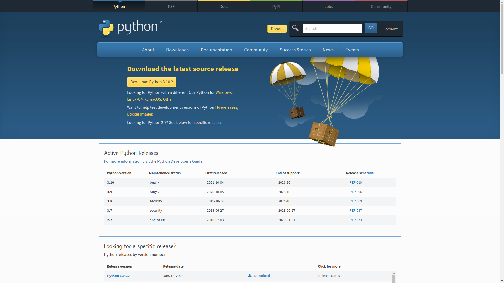
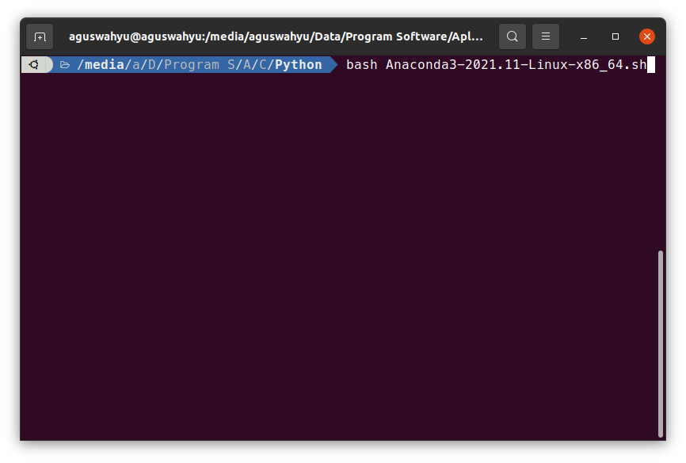
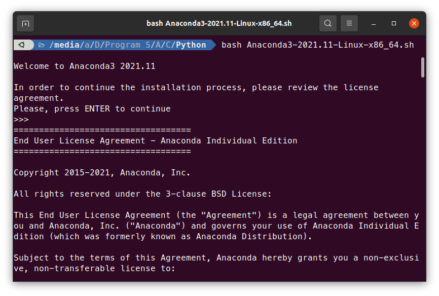
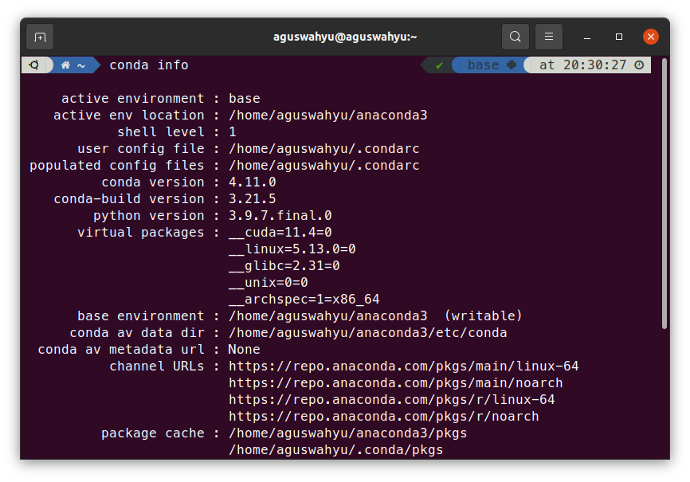
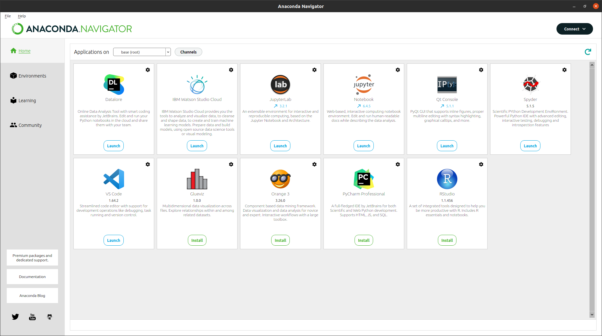

## Instal Python di Linux

Pada dasarnya, Python sebenarnya sudah terinstal secara default pada linux berbagai distro. Namun, jika kita ingin menginstal Python yang terbaru di linux, maka kita harus mengikuti langkah-langkah berikut:

1. Buka website Python pada link
  > https://www.python.org/downloads/
2. Download versi Pythn yang diinginkan. Disarankan versi yang terbaru
  
3. Namun, kita tidak menggunakan Python tersebut karena kita akan menggunakan tool data sains yang sangat keren yaitu Anaconda.

4. Unduh anaconda pada link berikut ini:
  > https://www.anaconda.com/download/
5. Silahkan unduh sesuai sistem operasi yang digunakan. Pada tutorial ini kita menggunakan Ubuntu.
  
6. Kemudian jalankan file sh tersebut melalui terminal dengan kode `bash Anaconda3-2021.11-Linux-x86_64.sh`
  
7. Kemudian, ikuti saja perintah yang ada pada terminal.
  
8. Setelah selesai, kita akan menemukan folder Anaconda3.
  
8. Untuk mengecek apakah anaconda terinstal dengan benar, maka ketikkan `conda info` pada terminal.
  
9. Kemudian jalankan anaconda pada terminal dengan kode `anaconda-navigator` maka akan muncul aplikasi yang bernama Anaconda Navigator.
   
10. Selamat, Python sudah terinstal dengan benar di komputer kamu.